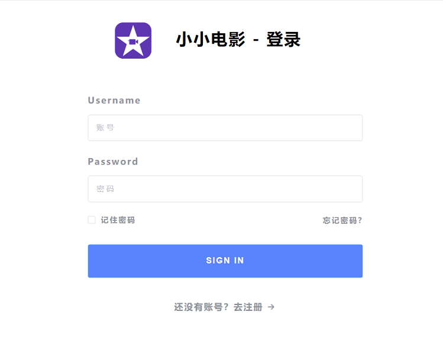
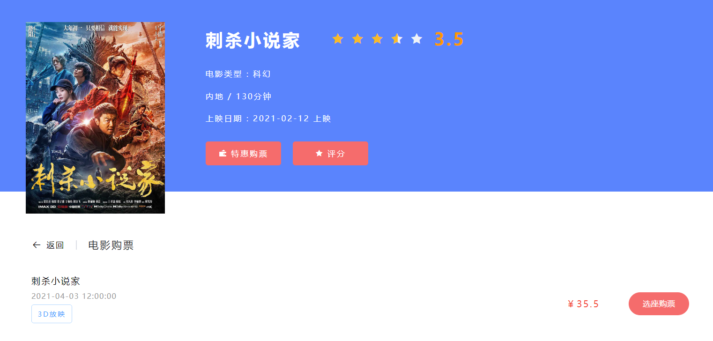
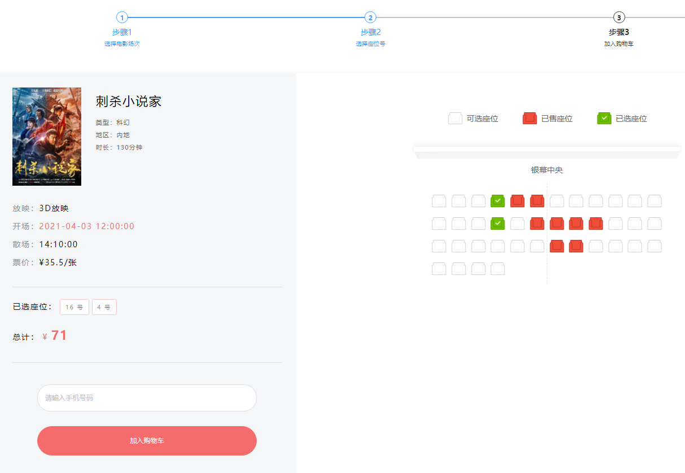
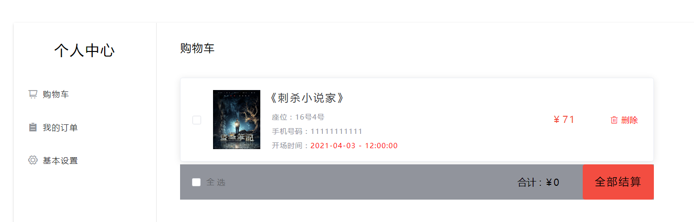
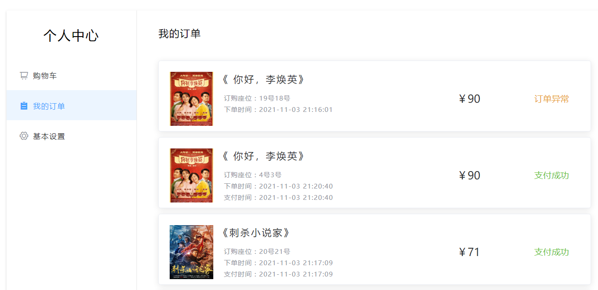
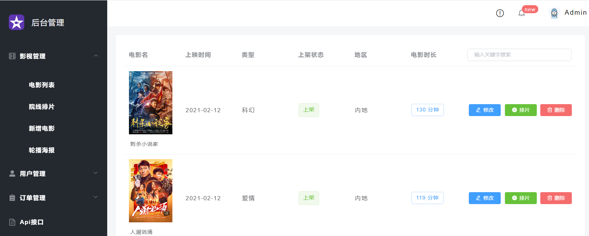

# 影院选座购票系统

## 系统设计

基于SpringBoot+MyBatis-Plus 的前后端电影项目，前端使用Vue+element ui，主要有影视管理、院线拍片、选座购票、影视管理、订单管理等功能，系统功能完善，界面美观大方。

## 功能介绍

### 前台功能

前台首页展示

前台登录界面

用户选择电影后进入购票页面

点击选座购票，选择喜欢的座位后，可以加入到购物车

随后点击全部结算，支付成功后可以在订单页面中查看

### 后台管理

后台管理主要有影视管理、用户管理、订单管理等功能，不再一一展开。代码已经开源，对项目部署运行有什么疑问，可以添加微信交流，微信：beyond-expression

